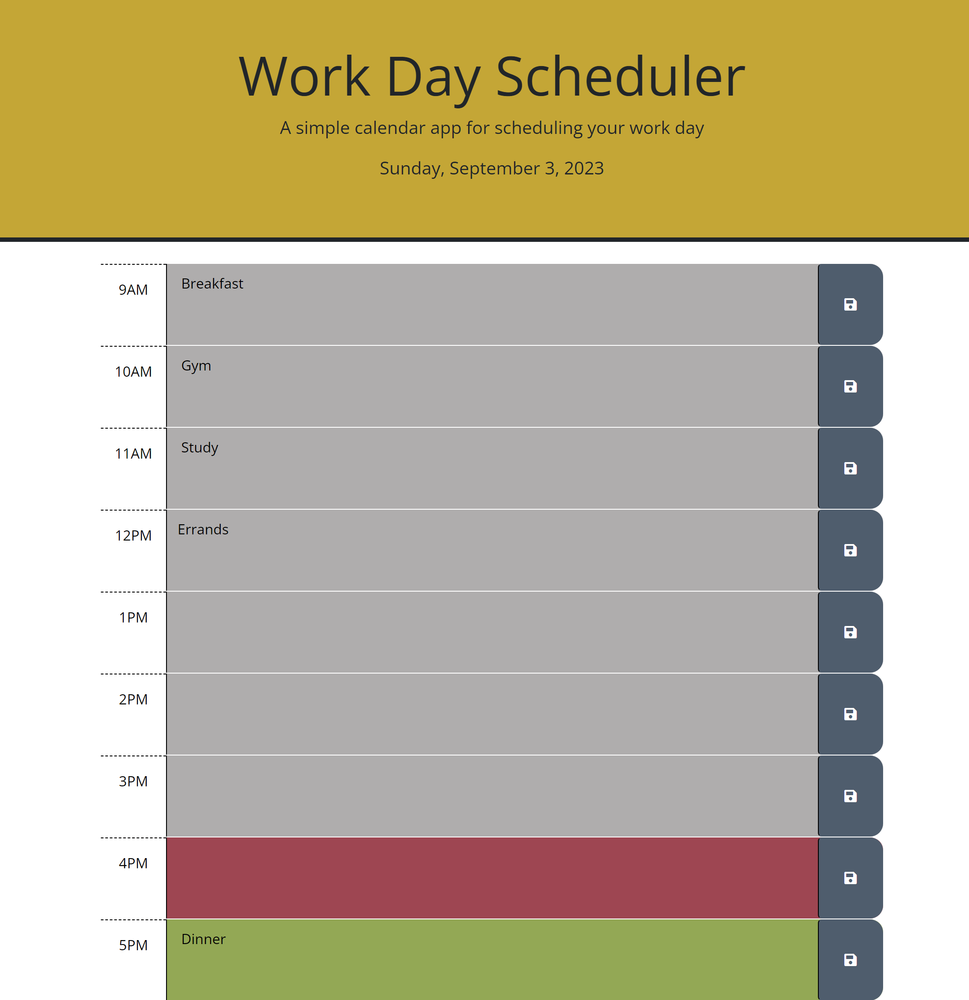

# employee-calendar

## Description

My motivation for this project was to help employees add important events in order to manage their time effectively within a 9-5 work day. This project gave me a lot of exposure to jQuery DOM traversal and more practice working with local storage. A challenge that I encountered while working on this project was getting the events to save even after the page had refreshed. This gave me the opportunity to become more familiar with using loops to iterate through arrays. I also used a loop to assign each div a color based on if the time slot was in the past, present, or future. Although it was not a requirement, I used the JS keyword "this" on the save button to display the word "saved" when the user clicked it. I used the setTimeout() method to make the word disappear and the button to revert back to its original state.

## Installation

N/A

## Usage

This employee calendar displays the current date at the top of the page. The calendar is automatically updated to show past, present, and future time slots within the day. Time slots that are gray show the past, red shows the present, and green shows the future. To get started, users can click on the time slot and type in the event they would like to add. To save this event, they will hit the gray save button to the right. When the page is refreshed, these events will not go away. To delete, edit, or add to an existing event, the user can just click on the timeslot again. After the changes have been made again, they can click on the gray save button again.

Link to deployed app:

## Credits

N/A

## License

N/A
